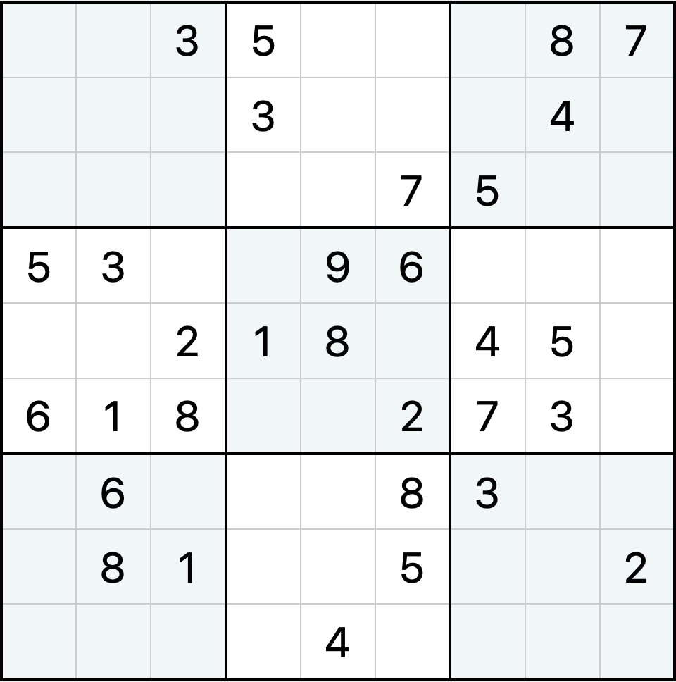

<div style="display: flex; width: 100%;">
    <div style="flex: 1; padding: 0px;">
        <p>© Albert Palacios Jiménez, 2024</p>
    </div>
    <div style="flex: 1; padding: 0px; text-align: right;">
        
    </div>
</div>
<br/>

# Exercici 0

Fes el joc de **"Sudoku"** amb JavaFX i WebSockets.

## Vistes

El joc ha de tenir tres vistes:

- La primera vista configura la connexió del servidor i el nom del jugador

- La segona vista és el taulell de joc del Sudoku

- La tercera vista mostra la llista de jugadors ordenada per punts i un botó per tornar a jugar (vista 2)

## Partida

El [Sudoku](https://ca.wikipedia.org/wiki/Sudoku) és un joc que té una graella de 9×9 files i columnes subdividida en 9 subgraelles de 3×3 anomenades regions.

<center>

</center>
<br/>

L'objectiu és col·locar un número de l'1 al 9 a cada cel·la de tal manera que mai coincideixin dos números iguals a cada línia horitzontal, vertical o a cada regió.

Per fer-lo multijugador el nostre sudoku permetrà jugar-hi tants jugadors com estiguin connectats a la partida, la llista de jugadors es mostrará a la dreta de la finestra, amb la puntuació de cada jugador.

Quan un jugador encerti el valor d'una casella:

- La casella es posarà amb un fons de color verd
- La casella quedarà bloquejada
- El judador sumarà dos punts

Quan un jugador s'equivoqui amb el valor d'una casella restarà un punt.

### Vista de la partida

El joc s'ha d'implementar amb JavaFX, la vista de la partida ha de:

- Tenir el taulell del sudoku a l'esquerra, per poder jugar
- Tenir la llista de jugadors amb la seva puntuació a la dreta
- Mostrar d'alguna manera clara el nom del jugador
- Permetre escollir una casella i posar-hi un valor de l'1 al 9

```text
 Juga: Albert
┌───────────────────────┬──────────────┐
│ 5 3 · │ · 7 · │ · · · │ Albert   12  │
│ 6 · · │ 1 9 5 │ · · · │ Marta     9  │
│ · 9 8 │ · · · │ · 6 · │ Joan      7  │
│───────┼───────┼───────│ Clota    11  │
│ ...                   │              │
│                       │              │
└───────────────────────┴──────────────┘
```