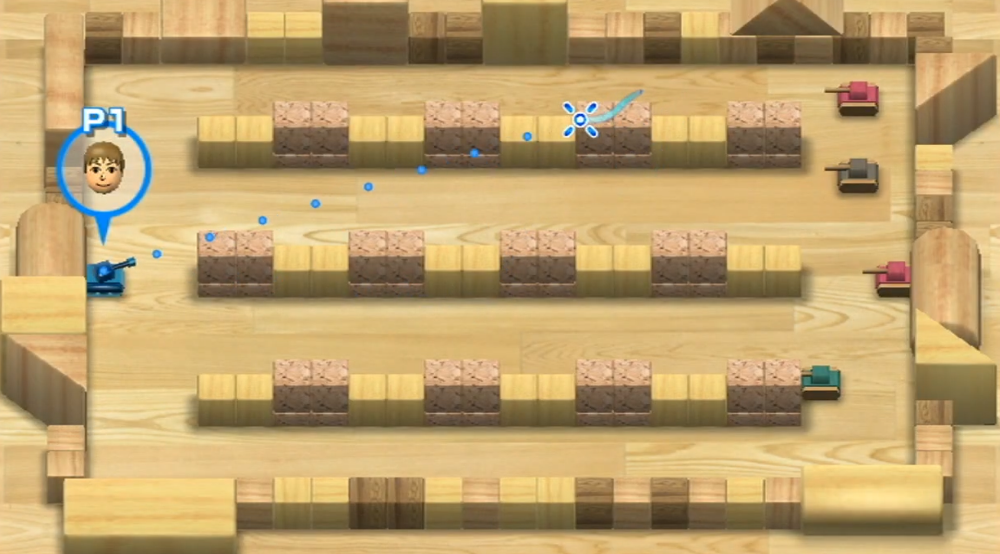
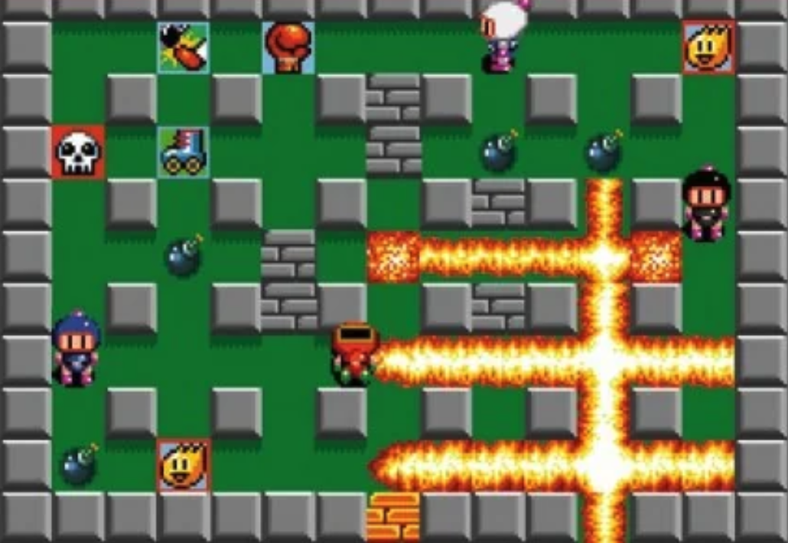
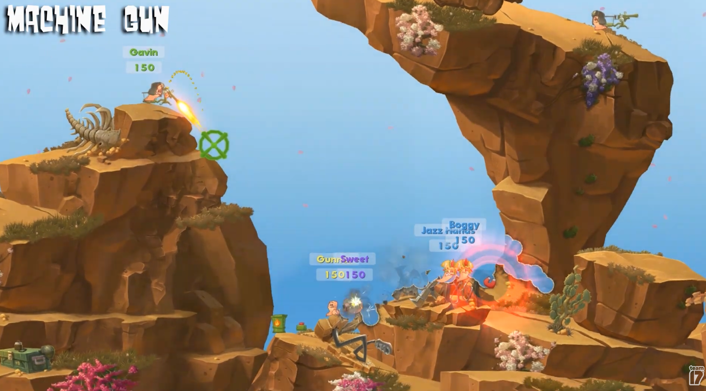

    

        
© Albert Palacios Jiménez, 2023

    

    

        
    

 

# Joc multijugador estil BattleRoyale 

Cal fer un joc multijugador en temps real amb un servidor de websockets **NodeJS**

Ha de permetre una partida d'almenys 5 jugador simultanis, i el joc ha de ser del tipus BattleRoyale (guanya el darrer jugador viu).

La mecànica del joc ha de tenir:

- Dispars o lluites entre jugadors

- Els jugadors han de tenir una barra de vida que es redueix quan reben danys, i moren quan arriba a zero

- Items per recuperar vida

- Animacions adequades (moviment, dany, mort, ...)

L'aplicació ha de permetre:

- Configurar el servidor (local, remot proxmox)

- Pantalla de càrrega de dades

- Pantalla d'espera de jugadors

- Partida

- Resultats de la partida amb el rànquing de jugadors

Podeu agafar idees d'aquests jocs i transformar-los en un 'BattleRoyale' per a 10 jugadors

**Wii Tanks**

    

  

**Bomberman**

    

  

**Asteroids**

    

  

**Worms**

    

  