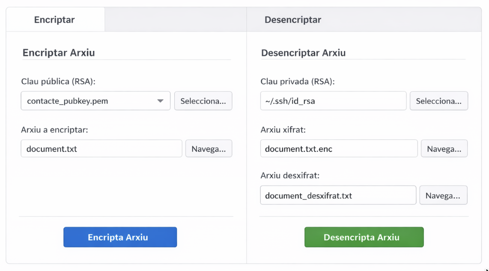

    

        
© Albert Palacios Jiménez, 2024

    

    

        
    

 

# Exercici 09, Encriptació i publicació

## Aplicació

Fes una aplicació Flutter que permeti encriptar arxius a través del sistema de *clau pública* i *clau privada*, per compartir-los de manera segura.

L'aplicació a de denir dues vites: 

**Encriptar**

- ha de permetre escollir una clau pública 'rsa' per encriptar 
- ha de permetre escollir un arxiu per encriptar 

**Desencriptar** 

- ha de permetre escollir una clau privada però per defecte ha de mostrar la ~/.ssh/id_rsa 

- ha de permetre escollir l'arxiu a desencriptar 

- ha de permetre escollir l'arxiu destí on es desencriptarà

Aquest és un disseny de les funcionalitats que s'esperen:

    

## Publicació

Exporta l'aplicació amb "--release" segons la documentació oficial de Flutter i el teu sistema operatiu.

Crea un paquet de distribució:

- **Linux**: un .deb, .rpm o Flatpak
- **Windows**: un .exe o .msi
- **MacOS**: un .dmg o .pkg

Afegeix una carpeta "dist" al teu repositori on guardis el paquet de i fes una "release" a GitHub amb aquest paquet.

Fes una pagina web a GitHub Pages on expliquis com utilitzar l'aplicació i on puguis descarregar el paquet binari *"release"* de l'aplicació.