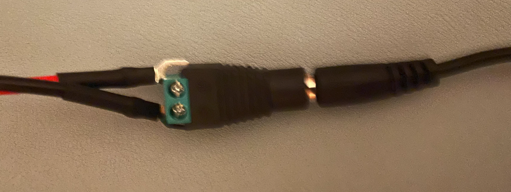

# Cablejat RPi - RGB LED

## **Important**:

La *Raspberry Pi* no té botó d'encesa/apagat. Assegura't que:

- Connecta la resta de cables abans de connectar l'alimentació a la RPi.
- Apaga la RPi amb **"sudo shutdown -h now"** abans de desconnectar qualsevol cable.

```bash
sudo shutdown -h now
```

### Panell RGB LED (no cal tocar les connexions):

<center>

</center>

### Font d'alimentació al panell:

<center>

</center>

### Panell a RPi:

**Important**: 

- El connector gris ha d'ocupar tots els pins de la RPi.
- La part *"retallada"* ha d'estar al cantó oposat dels ports USB.

<center>

</center>

<center>

</center>

### Font d'alimentació a la RPi:

**Important**: La última connexió que s'ha de fer:

<center>

</center>
