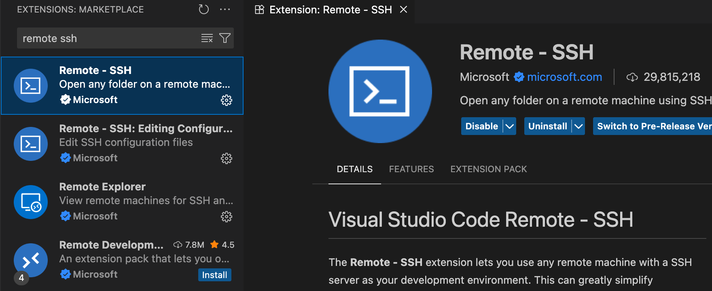

# Software

## Connexió amb la RPi

Un cop iniciada la RPi (la llum verda deixa de parpellejar):

<center>

</center>

Pots connectar amb la RPi fent servir el seu nom de xarxa (hostname):

```bash
ssh pi@dampiX.local
```

- El primer cop potser et demana la confirmació.
- L'usuari és **pi**
- La contrasenya per defecte és **1234**

```text
Are you sure you want to continue connecting (yes/no/[fingerprint])? yes
Warning: Permanently added 'dampi0.local' (ED25519) to the list of known hosts.
pi@dampi0.local's password: 
```

## Projecte RPi-RGBLED

Tot el què fa falta per controlar el panell RGB LED està a:

```bash
cd ~/Adafruit_Pi5_Piomatter/piomatter-java-jni/
```

No toquis els arxius d'aquesta carpeta:

- **jni**: conté el codi del *bridge* entre Java i la llibreria C++ del panell.
- **build_lib.sh**: compila i genera el *bridge*.
- **src_backup.zip**: té una còpia dels codis originals, per recuperar-los si cal.
- **restore_src_backup.sh**: restaura els codis originals (**esborra la carpeta "src"!**).
- **run.sh**: compila i executa el projecte amb *maven*.

## Demos

Hi ha dues demos a la carpeta del package **"com.demos"**:

```text
src/main/java/com/demos/
```

```bash
# Exemple de dibuix bàsic:
./run.sh com.demos.DemoIETI

# Exemple de bucle d'animació amb càlcul de FPS:
./run.sh com.demos.DemoAnim
```

## Exemple amb WebSockets

Hi ha un exemple de servidor/client WebSockets a:

```text
ls src/main/java/com/project/server/
ls src/main/java/com/project/client/
```

Per fer-los anar:

```bash
./run.sh com.project.server.Main
./run.sh com.project.client.Main
```

En aquest exemple el servidor envia *textos* i *imatges* al client a través de WebSockets.

Amb el servidor i el client en marxa, des de la consola del servidor pots:

```text
/text Hola a tothom!
/image ./src/main/resources/ietilogo.png
/quit
```

> **Important**: Atura el servidor correctament amb **/quit** per evitar problemes de connexió en futures execucions.

## Compartir arxius amb la RPi

Per descarregar arxius des de la RPi al teu ordinador, posa:

- Com a primer paràmetre *pi@dampiX.local:(la ruta de l'arxiu remot que vols descarregar)*.
- Com a segon paràmetre la carpeta local on deixar l'arxiu *(./)*.
 
```bash
scp pi@dampiX.local:/home/pi/Adafruit_Pi5_Piomatter/piomatter-java-jni/src/main/resources/ietilogo.png ./
```

Per enviar arxius des del teu ordinador a la RPI, posa:

- Com a primer paràmetre la ruta de l'arxiu local.
- Com a segon paràmetre *pi@dampiX.local:(la carpeta remota on vols deixar l'arxiu)*.

```bash
scp ./test.png pi@dampiX.local:/home/pi/Adafruit_Pi5_Piomatter/piomatter-java-jni/src/main/resources/
```

## Visual Studio Code

Per treballar més còmodament pots convigurar **"Visual Studio Code"** per editar i obrir terminals a la RPi des del teu ordinador.

Instal·la l'extensió **"Remote - SSH"** a Visual Studio Code.

<center>

</center>

<center>

</center>
<br/>

Obre o crea l'arxiu:

```bash
~/.ssh/config
```

I afegeix aquesta configuració (canvia la X pel número corresponent):

```text
Host dampiX
    HostName dampiX.local
    User pi
    PubkeyAuthentication no
    PasswordAuthentication yes
```


Amb l'extensió i l'arxiu anterior llestos, escriu **">remote-ssh"** al buscador, i escull **"Remote-SSH: Connect to Host..."**.

<center>

</center>
<br/>

Hauria d'aparèixer el host **dampiX** a la llista:

<center>

</center>
<br/>

És possible que el primer cop hagi d'instal·lar software:

<center>

</center>
<br/>

Escriu el *password* de l'usuari **pi** (per defecte és **1234**):

<center>

</center>
<br/>

Obre la carpeta del projecte **"/home/pi/Adafruit_Pi5_Piomatter/piomatter-java-jni/"**:

<center>

</center>

<center>

</center>
<br/>

Veuràs els arxius remots normalment:

<center>

</center>
<br/>

Podràs obrir terminals remots normalment:

<center>

</center>
<br/>